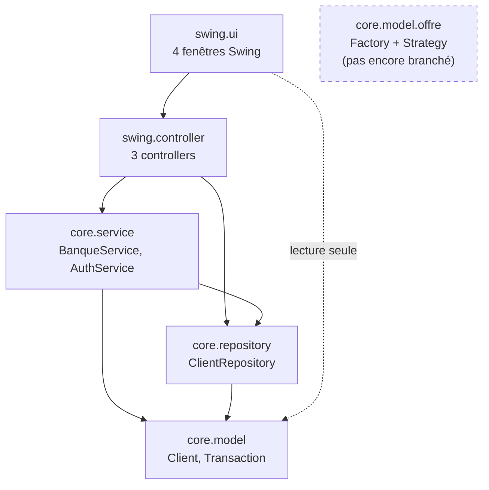

# bank — application bancaire Java

**État au 17 août 2026** · Java 21 · Maven multi-module · Swing · JUnit 5 · GitHub Actions

Application bancaire de bureau : authentification, consultation de compte, Livret A, virements entre clients, historique des transactions. Le projet sert de terrain d'application pour la POO, l'architecture en couches, les patrons de conception, les tests unitaires et l'intégration continue.

---

## Sommaire

1. [Démarrage rapide](#1-démarrage-rapide)
2. [Architecture](#2-architecture)
3. [Le cœur métier — `bank-core`](#3-le-cœur-métier--bank-core)
4. [Le package `offre` — Abstract Factory + Strategy](#4-le-package-offre--abstract-factory--strategy)
5. [L'interface graphique — `bank-swing`](#5-linterface-graphique--bank-swing)
6. [Tests](#6-tests)
7. [Intégration continue](#7-intégration-continue)
8. [Analyse complète — état de santé](#8-analyse-complète--état-de-santé)
9. [Dette technique restante](#9-dette-technique-restante)
10. [Feuille de route](#10-feuille-de-route)
11. [Conventions du projet](#11-conventions-du-projet)
12. [Historique des chantiers](#12-historique-des-chantiers)

---

## 1. Démarrage rapide

```bash
# Compiler les deux modules
mvn clean package

# Lancer l'application
java -jar bank-swing/target/bank-swing-1.0-SNAPSHOT.jar

# Lancer les tests (depuis la racine, jamais depuis un module)
mvn test
```

Pendant le développement, sans repackager le jar :

```bash
mvn compile
java -cp bank-swing/target/classes:bank-core/target/classes com.example.bank.swing.Main
```

**Comptes de démonstration** (chargés en mémoire au lancement) :

| Nom | Mot de passe | RIB | Compte courant | Livret A |
|---|---|---:|---:|---:|
| `Mouh` | `tata` | 123 | 0,00 € | 1 000,00 € |
| `amine` | `matoub` | 456 | 300,00 € | — |

> ⚠️ Les deux champs de la fenêtre de connexion sont en `setPreferredSize(1, 1)` : ils sont presque invisibles à l'écran. Défaut connu, voir [§9](#9-dette-technique-restante).

**Prérequis** : JDK 21, Maven 3.6+. Le wrapper `./mvnw` est présent si Maven n'est pas installé.

---

## 2. Architecture

Projet Maven à trois POM : un parent `pom` et deux modules.

```
bank/
├── pom.xml                    parent (packaging pom, JDK 21, versions de plugins)
├── bank-core/                 cœur métier — Java pur, AUCUNE dépendance UI
│   ├── pom.xml
│   ├── src/main/java/com/example/bank/core/
│   │   ├── model/             Client, Transaction, Montants
│   │   ├── model/offre/       Abstract Factory + Strategy (offres bancaires)
│   │   ├── service/           BanqueService, AuthService
│   │   ├── repository/        ClientRepository + implémentation mémoire
│   │   └── exception/         6 exceptions métier
│   └── src/test/java/…        97 tests JUnit 5
├── bank-swing/                interface graphique — dépend de bank-core
│   ├── pom.xml
│   └── src/main/java/com/example/bank/swing/
│       ├── Main.java          point d'assemblage (composition root)
│       ├── controller/        LoginController, CompteController, VirementController
│       └── ui/                4 fenêtres Swing
└── .github/workflows/ci.yml   compile + tests à chaque push et PR
```

### Sens des dépendances



La règle structurante : **`bank-core` ne connaît pas `bank-swing`**. Vérifié mécaniquement — aucune classe du cœur n'expose de type `javax.swing` ou `java.awt`, et les fenêtres n'importent que `core.model` et `core.exception`, jamais `core.service` ni `core.repository`.

### Chiffres

| | Fichiers | Lignes |
|---|---:|---:|
| `bank-core` (main) | 33 | 1 319 |
| `bank-swing` (main) | 8 | 542 |
| Tests | 15 | 1 071 |
| **Total** | **56** | **2 932** |

---

## 3. Le cœur métier — `bank-core`

### La règle de placement modèle vs service

> **Le modèle est propriétaire de son état et de rien d'autre. Dès qu'une opération a besoin d'un deuxième objet métier ou d'une donnée qu'il ne possède pas, elle monte dans le service.**

Test pratique appliqué à chaque méthode : *« pour l'exécuter, ai-je besoin de quelque chose qui n'est pas déjà dans `this` ? »*

| Opération | Emplacement | Pourquoi |
|---|---|---|
| `Client.verifierMotDePasse(saisie)` | **modèle** | ne lit que le champ `mdp` de l'objet lui-même |
| `Client.crediter` / `debiter` | **modèle** | modifient le solde du client, personne d'autre |
| `BanqueService.virer(émetteur, destinataire, montant)` | **service** | touche **deux** `Client` à la fois |
| `AuthService.authentifier(nom, mdp)` | **coupé en deux** | chercher le client exige le repository, vérifier son mot de passe non |

C'est cette règle qui a fait disparaître `getMdp()` : le mot de passe ne sort jamais de l'objet `Client`.

### Modèle

- **`Client`** — nom, mot de passe, RIB, solde du compte courant, Livret A optionnel, historique. N'accède jamais à un autre `Client`, à un repository, ni à la console.
- **`Transaction`** — immuable : montant, type (`DEPOT` / `RETRAIT` / `VIREMENT`), description, horodatage `LocalDateTime`.
- **`Montants`** — point unique pour l'échelle monétaire : 2 décimales, `RoundingMode.HALF_EVEN`, refus des montants nuls ou négatifs.

### Services

`BanqueService` : `deposer`, `retirer`, `creerLivretA`, `virerVersLivretA`, `virer`, `rechercherParRib`.
`AuthService` : `authentifier`, avec un message d'erreur **identique** pour un nom inconnu et un mot de passe faux — pour ne pas révéler quels comptes existent.

### Repository

`ClientRepository` (interface) + `InMemoryClientRepository` (`Map<Integer, Client>` indexée par RIB). La `Map` remplace l'ancien `Client[2]` : recherche en O(1), unicité du RIB garantie par la structure, nombre de clients non figé.

### Exceptions métier

Toutes héritent de `BanqueException extends RuntimeException`, ce qui permet à l'IHM d'écrire un seul `catch` et d'afficher `e.getMessage()` dans un `JOptionPane`.

`MontantInvalideException` · `SoldeInsuffisantException` · `ClientIntrouvableException` · `LivretAAbsentException` · `VirementVersSoiMemeException`

---

## 4. Le package `offre` — Abstract Factory + Strategy

Structure posée pour les offres commerciales, **pas encore branchée** au reste de l'application.

Chaque produit a son package, l'interface à la racine et les implémentations dans `concret/` :

```
model/offre/
├── OffreFactory                    (Abstract Factory)
│   └── concret/  OffreEtudianteFactory, OffreStandardFactory, OffrePremiumFactory
├── compte/   Compte      → concret/  CompteEtudiant, CompteStandard, ComptePremium
├── carte/    CarteBancaire → concret/  CarteJeune, CarteClassique, CarteBlack
├── pret/     Pret        → concret/  PretEtudiant, PretPersonnel, PretImmobilier
└── taux/     TauxInteretStrategy (Strategy) → concret/  TauxLivretAEtudiant/Standard/Premium
```

**L'intérêt du patron** : les combinaisons incohérentes deviennent impossibles. On ne peut pas obtenir une `CarteBlack` avec un `CompteEtudiant`, parce qu'aucune fabrique ne les produit ensemble.

```java
OffreFactory factory = new OffreEtudianteFactory();

Compte compte = factory.creerCompte();                   // CompteEtudiant
CarteBancaire carte = factory.creerCarte();              // CarteJeune
Pret pret = factory.creerPret();                         // PretEtudiant
TauxInteretStrategy taux = factory.creerStrategieTaux(); // TauxLivretAEtudiant

// Changer d'offre = changer la seule ligne de construction.
```

### Les trois tiers

| | Compte : découvert / frais | Carte : plafond / cotisation | Prêt : taux / durée | Taux épargne |
|---|---|---|---|---|
| **Étudiante** | 0 € / 0 € | 500 € / 0 € | 0,90 % / 60 mois | 2,00 % |
| **Standard** | 300 € / 2 € | 1 500 € / 45 € | 4,50 % / 48 mois | 3,00 % |
| **Premium** | 2 000 € / 12 € | 10 000 € / 300 € + assurance | 3,20 % / 240 mois | 4,50 % |

Toutes ces valeurs sont marquées `VALEURS D'EXEMPLE, à ajuster` dans le code.

### Choix d'implémentation

Les règles partagées sont des **méthodes `static` sur les interfaces**, pas recopiées dans chaque implémentation :

- `Compte.soldeApresCredit` / `soldeApresDebit` réutilisent `Montants.exigerPositif` et `SoldeInsuffisantException` — exactement les règles de `Client`, aucune réinventée. Chaque compte concret se réduit à une ligne, seule la constante de découvert change.
- `Pret.mensualite(capital, taux, durée)` écrit la formule d'amortissement `M = C×t×(1+t)ⁿ / ((1+t)ⁿ−1)` une seule fois. Calcul intermédiaire en `MathContext(16)`, arrondi au centime une seule fois à la fin.

**Conventions à connaître** : les taux sont en fraction décimale (`0.0450` = 4,50 %), et le découvert est un montant positif (`2000.00` = le solde peut descendre à −2 000 €).

---

## 5. L'interface graphique — `bank-swing`

### Controllers

Les fenêtres ne parlent qu'à leur controller, jamais au service ni au repository.

| Controller | Dépend de | Expose |
|---|---|---|
| `LoginController` | `AuthService` | `authentifier(nom, mdp)` → `Client` ou exception |
| `CompteController` | `BanqueService` | `deposer`, `retirer`, `rafraichir(client)` |
| `VirementController` | `BanqueService`, `ClientRepository` | `virer(ribÉmetteur, ribDestinataire, montant)`, `virerVersLivretA(rib, montant)` |

### Fenêtres

`GestionnaireInterfaceGraphique` (connexion) → `ClientInfoWindow` (tableau de bord) → `VirementWindow` / `HistoriqueWindow`.

`ClientInfoWindow` ne reçoit **aucune copie** de champs : elle garde une référence au `Client` et redemande son état au controller après chaque opération. `VirementWindow` la prévient par un `Runnable` quand un virement aboutit. C'est ce qui corrige l'affichage figé après un virement.

Swing est démarré sur l'EDT via `SwingUtilities.invokeLater` depuis `Main`, qui est le seul endroit sachant quelle implémentation de repository est utilisée.

---

## 6. Tests

**97 tests JUnit 5, tous verts**, exclusivement sur le package `offre`.

```bash
mvn test        # Tests run: 97, Failures: 0, Errors: 0, Skipped: 0
```

| Classe testée | Tests | Couvre |
|---|---:|---|
| 3 × `OffreXxxFactory` | 15 | les 4 types produits par tier, non-partage d'instance |
| `CompteEtudiant` | 11 | crédit/débit, montants invalides, découvert 0 € |
| `CompteStandard` | 12 | idem + découvert 300 € (limite exacte et dépassement) |
| `ComptePremium` | 12 | idem + découvert 2 000 € |
| `CarteJeune` / `CarteClassique` / `CarteBlack` | 4 / 4 / 5 | plafond, cotisation, état actif, blocage, assurance |
| 3 × `PretXxx` | 10 chacun | taux, durée, 2 mensualités calculées à la main, arrondi, montants refusés |
| 3 × `TauxLivretAXxx` | 1 / 1 / 2 | taux exact + hiérarchie croisée des trois tiers |

**Qualité de la suite, vérifiée** :

- Les mensualités attendues ont été **calculées indépendamment du code testé** (Python `decimal`, précision 50, `ROUND_HALF_EVEN`) avant d'être écrites dans les tests : 170,51 € / 85,25 € (Étudiant), 342,05 € / 456,07 € (Personnel), 1 129,33 € / 846,99 € (Immobilier). Les tests vérifient donc la formule, pas sa simple reproduction.
- **Test de mutation** : passer le découvert de `CompteStandard` de 300 à 0 € fait tomber 3 tests et échouer le build. La suite n'est pas complaisante.
- Les `BigDecimal` sont comparés avec `compareTo`, jamais `equals` — qui compare aussi l'échelle (`"60"` ≠ `"60.00"`).

---

## 7. Intégration continue

`.github/workflows/ci.yml` — déclenché sur push vers `main` et sur toute PR ciblant `main`.

| Étape | Rôle |
|---|---|
| `actions/checkout@v4` | clone le dépôt |
| `actions/setup-java@v4` | JDK 21 Temurin + cache Maven |
| `mvn -B clean compile` | compile les deux modules, `bank-swing` inclus |
| `mvn -B test` | lance la suite depuis le pom parent |
| `EnricoMi/publish-unit-test-result-action@v2` | publie le rapport dans l'onglet Checks et en commentaire de PR |

Le job passe au rouge si la compilation ou un test échoue — vérifié : `mvn -B test` avec un test rouge renvoie **exit code 1**.

> `maven-surefire-plugin` est épinglé en 3.2.5 dans le pom parent. Sans cet épinglage, Maven 3.6 utilise surefire 2.12.4, qui ne connaît que JUnit 4 et **ignorerait les 97 tests en silence** en affichant `BUILD SUCCESS`.

---

## 8. Analyse complète — état de santé

### Ce qui est solide

| Domaine | État |
|---|---|
| **Exactitude métier** | Montants en `BigDecimal`, échelle 2, `HALF_EVEN`. Validation systématique des montants. Aucun solde ne devient négatif hors découvert autorisé. |
| **Architecture** | Trois couches réellement étanches, vérifiées par analyse des imports. Le cœur est réutilisable par un futur frontal REST sans y toucher. |
| **Traçabilité** | Toute opération produit une `Transaction` horodatée immuable. Un virement en produit **deux** — une chez l'émetteur, une chez le destinataire. |
| **Gestion d'erreurs** | Exceptions métier typées, hiérarchisées sous `BanqueException`, remontées jusqu'à l'utilisateur en `JOptionPane`. Plus aucun `System.out.println` porteur d'information métier. |
| **Patrons** | Abstract Factory et Strategy correctement posés, testés en isolation. |
| **Filet de sécurité** | 97 tests, CI verte à chaque push. |

### Les neuf bugs critiques du départ, tous corrigés

| Bug d'origine | Correction |
|---|---|
| `soldeCompte =+ montant` — le dépôt écrasait le solde | `BigDecimal.add`, vérifié : deux dépôts de 500 € → 1 000 € |
| Tout virement sortant débitait le **Livret A** | Deux méthodes distinctes : `virerVersLivretA` et `virer` |
| Aucune validation du montant | `Montants.exigerPositif` sur toutes les opérations |
| Le retrait ne vérifiait pas le solde | `SoldeInsuffisantException`, solde intact après échec |
| Le destinataire n'avait pas de ligne d'historique | Transaction créée des deux côtés |
| Virement vers soi-même autorisé | `VirementVersSoiMemeException` |
| Message d'échec de connexion répété N fois | `if` sorti de la boucle, `JOptionPane` visible |
| Date de transaction jamais enregistrée | Champ `final LocalDateTime date` |
| `float` pour des montants | `BigDecimal` partout — vérifié : 10 × 0,10 € = exactement 1,00 € |

Deux failles de sécurité de base ont aussi été traitées : le champ mot de passe est un `JPasswordField`, et `getMdp()` a été remplacé par `verifierMotDePasse(saisie)`.

---

## 9. Dette technique restante

### 🔴 Bloquant pour un usage réel

| # | Problème | Détail |
|---|---|---|
| 1 | **Aucune persistance** | `InMemoryClientRepository` seulement. Tout est perdu à la fermeture, et rien ne permet de créer un compte depuis l'application. |
| 2 | **Mots de passe en clair** | `Client.verifierMotDePasse` fait un `mdp.equals(saisie)`. Aucun hachage. |
| 3 | **Aucune limitation des tentatives** | Force brute possible sur la fenêtre de connexion. |

### 🟠 Dette structurelle

| # | Problème | Détail |
|---|---|---|
| 4 | **Deux modélisations du compte coexistent** | `Client` porte `soldeCompte` / `soldeLivretA` en dur, tandis que `model.offre.compte.Compte` existe en parallèle sans lien. C'est la convergence la plus importante à traiter : `Client` devrait posséder une `List<Compte>`. |
| 5 | **Le package `offre` n'est appelé nulle part** | Vérifié : zéro import depuis `service/`, `repository/` ou l'IHM. Structure prête, non branchée. |
| 6 | **`LivretA` n'est pas une classe** | Le Livret A est un `boolean` + un `BigDecimal` dans `Client`. `TauxInteretStrategy` n'a donc rien où être injecté, et aucun intérêt n'est calculé. |
| 7 | **Le cœur historique n'est pas testé** | `Client`, `BanqueService`, `AuthService`, les repositories et les controllers n'ont **aucun test**. Les 97 tests portent uniquement sur `offre`. |
| 8 | **Le Livret A s'ouvre à zéro sans alimentation possible via l'IHM** | `creerLivretA(client)` ouvre à 0 €, mais aucun écran ne permet d'ouvrir un Livret A. |

### 🟡 Confort et finitions

| # | Problème | Détail |
|---|---|---|
| 9 | **Champs de connexion invisibles** | `setPreferredSize(new Dimension(1, 1))` alors que le commentaire d'origine annonçait 200 px. Correctif d'une ligne. |
| 10 | **Pas de déconnexion** | La fenêtre de login reste ouverte après connexion, et plusieurs `ClientInfoWindow` peuvent être ouvertes. |
| 11 | **Écrans manquants** | `CompteController.deposer/retirer` existent et sont fonctionnels mais ne sont câblés à aucun bouton. |
| 12 | **Pas de mesure de couverture** | JaCoCo n'est pas configuré. |
| 13 | **`.idea/` est versionné** | Configuration IntelliJ commitée à la racine du dépôt. |
| 14 | **Rien n'est commité** | L'intégralité du travail (restructuration multi-module, package `offre`, tests, CI) est dans le working tree, non commitée. |

---

## 10. Feuille de route

**Étape immédiate — committer.** Le working tree contient plusieurs chantiers non commités. Découper en commits thématiques : restructuration multi-module, package `offre`, tests, CI.

**Phase A — Tester le cœur historique.** Porter la méthode déjà appliquée à `offre` sur `Client`, `BanqueService` et `AuthService`. C'est le prérequis avant toute refonte du modèle : sans tests sur `virer`, la convergence de la dette n°4 se fera à l'aveugle.

**Phase B — Faire converger `Client` et `offre.Compte`.** Remplacer `soldeCompte` / `livretAExiste` / `soldeLivretA` par une `List<Compte>`, introduire `LivretA` comme implémentation de `Compte` recevant sa `TauxInteretStrategy` par injection. C'est ce qui donne enfin un sens au package `offre`, et ce qui permet d'ajouter d'autres produits (LDD, PEL, compte joint) sans toucher au reste.

**Phase C — Persistance.** Implémenter `JdbcClientRepository` sur SQLite ou H2. Deux points non négociables : `PreparedStatement` uniquement, et un virement doit être **une transaction SQL atomique** (débit et crédit valident ou échouent ensemble).

**Phase D — Sécurité.** BCrypt sur les mots de passe, verrouillage après 3 tentatives, journal d'audit des connexions et opérations sensibles.

**Phase E — Finir l'IHM.** Écrans de dépôt, retrait, inscription, ouverture de Livret A, souscription d'offre. Déconnexion et cycle de vie des fenêtres. Corriger les champs de connexion.

**Phase F — Fonctionnalités bancaires.** Versement des intérêts du Livret A (plafond réglementaire 22 950 €), virements programmés, agios sur découvert, export de relevé CSV puis PDF.

**Phase G — Web (optionnel).** Module `bank-web` en JAX-RS consommant le même `bank-core`, authentification JWT, front léger. L'architecture actuelle rend cette étape possible sans toucher au cœur.

---

## 11. Conventions du projet

- **Montants** : `BigDecimal` uniquement, jamais `float` ni `double`. Échelle 2, `RoundingMode.HALF_EVEN`. Passer par `Montants`.
- **Taux** : fraction décimale (`0.0320` = 3,20 %).
- **Découvert** : montant positif, exprime jusqu'où le solde peut descendre sous zéro.
- **Erreurs métier** : lever une sous-classe de `BanqueException`, jamais écrire sur la console.
- **Nommage** : `PascalCase` pour les classes, packages en minuscules, implémentations concrètes dans un sous-package `concret/`.
- **Tests** : `@DisplayName` en français, une assertion logique par test, `assertThrows` avec le type exact, `BigDecimal` comparé par `compareTo`.
- **Commandes Maven** : toujours depuis la racine, jamais depuis un module.

---

## 12. Historique des chantiers

| Chantier | Contenu |
|---|---|
| **Audit initial** | Analyse du projet d'origine : 9 bugs critiques identifiés et reproduits à l'exécution, structure cassée (le projet était logé **dans** `.idea/`), mélange WAR Jakarta EE + Swing. |
| **Assainissement** | Sortie de `.idea/`, suppression du squelette Jakarta EE mort, renommage des classes aux conventions Java, correction des 9 bugs, `JPasswordField`, alignement JDK 21. |
| **Architecture en couches** | Découpage en `bank-core` / `bank-swing`, création des couches service / repository / exception, controllers, correction de l'affichage figé, démarrage sur l'EDT. |
| **Patrons de conception** | Package `offre` : Abstract Factory (3 tiers × 4 produits) et Strategy pour les taux. 20 fichiers. |
| **Tests** | 97 tests JUnit 5 sur `offre`, épinglage de surefire, validation par test de mutation. |
| **CI** | Workflow GitHub Actions : compile + tests + rapport, sur push et PR. |

---

*Document de référence du projet. À mettre à jour à chaque chantier structurant.*
